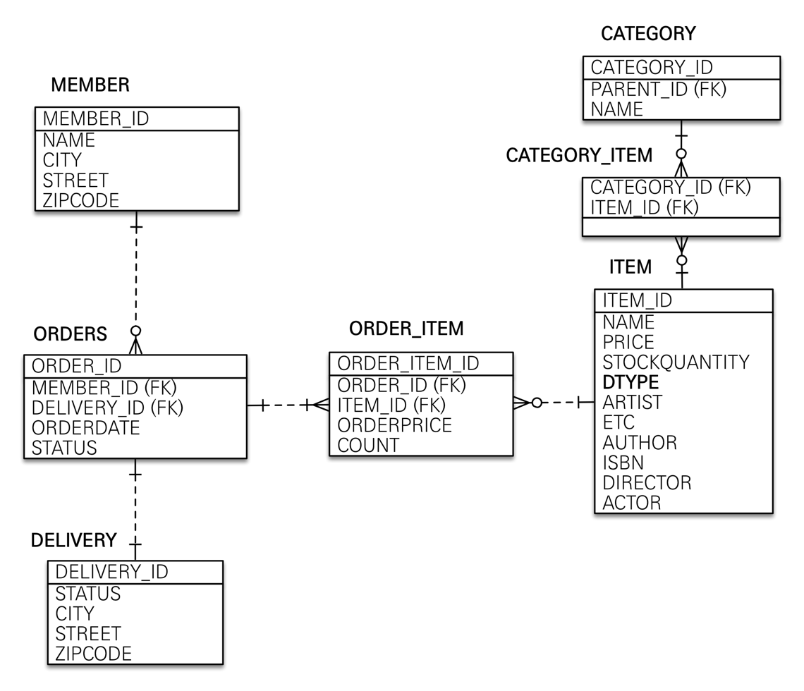

# 20210916_Initialize Project
- Gradle
- Java
- Dependencies
  - Spring Data JPA
  - Thymeleaf
  - Spring Web
  - Lombok
  - H2 Database // 개발 교육, 테스트 환경에서 편리함

### DevTools
+) implementation 'org.springframework.boot:spring-boot-devtools'   
개발시 유용한 기능들을 제공해줌.
- template 갱신 후 Build - Recompile => 서버 재실행하지 않아도 화면 자동 갱신

### H2 설정
- JDBC URL: jdbc:h2:~/jpashop
- home에서 jpashop.mv.db 생성 확인후 disconnect
- 이후 JDBC URL: jdbc:h2:tcp://localhost/~/jpashop 으로 접근

### 
- resources/application.properties 삭제
- resources/application.yml 생성
- 차이?

### 빌드하고 실행하기
````
$ ./gradlew clean build
$ cd build/libs
$ ls
$ java -jar jpashop-0.0.1-SNAPSHOT.jar
^C
````

### 쿼리 파라미터 로그 남기기
- 실운용 시 성능 문제가 생길 수 있음..  
implementation 'com.github.gavlyukovskiy:p6spy-spring-boot-starter:1.5.6'


# 20210917_ Add Domains & Create Tables



### 실무에서는
- 가급적 Setter는 사용하지 않는 것이 좋음
- @ManyToMany 사용 X 
  - 중간 테이블이 필요한데, 중간 테이블에 컬럼을 추가할 수 없고 세밀하게 쿼리를 실행하기 어렵다.
  - 중간 엔티티 생성하여 @ManyToOne, @OneToMany로 매핑하여 사용할 것
- 값 타입(@Embeddable)은 변경 불가능하게 설계
  - @Setter 제거, 생성자에서 값을 모두 초기화하는 변경 불가능한 클래스로 생성
- 모든 연관관계는 지연로딩(LAZY)으로 설정 (fetch = FetchType.LAZY)
  - @XToOne -> 즉시로딩

# 20210918_ Add MemberRepository, MemberService

### 테스트 케이스를 위한 설정
- 테스트는 메모리 DB를 사용하는 것이 가장 이상적이다.
- 추가로 테스트 케이스를 위한 스프링 환경과, 일반적으로 애플리케이션을 실행하는 환경은 보통 다르므로 설정 파일을 다르게 사용하자. 
  - 다음과 같이 간단하게 테스트용 설정 파일을 추가하면 된다.
    - test/resources/application.yml
    - TEST 에서는 DB를 설정해 주지 않으면 기본적으로 인메모리로 실행된다..!
  
# 20210919_ Add Item, Order Repo/Service AND TEST
- Add ItemRepository, ItemService, NotEnoughStockException
  - NotEnoughStockException : RuntimeException 전체 메서드 Override
- Add OrderRepository, OrderService
  - 생성 메서드 사용 시, 기존 생성자는 접근 제한을 거는 것이 좋음.
    - @NoArgsConstructor(access = AccessLevel.PROTECTED)
  
### 도메인 모델 패턴
: 엔티티에 대부분의 비즈니스 로직이 기술되어 있고, 서비스는 단순히 엔티티에 필요한 요청을 위임하여 처리하는 방식
### <-> 트랜잭션 스크립트 패턴
: 반대로 엔티티에는 비즈니스 로직이 거의 없고 서비스 계층에서 대부분의 비즈니스 로직을 처리하는 방식

# JPA 동적 쿼리

# 20210920_ Home Layout
- /resources
  - /static
    - /css
    - /js
  - /templates
    - /fragments
    - home.html
    
* 강제로 css/js 복붙하면 바로 적용 X => resources 디렉토리 reload & Build Project

# Add MemberForm, MemberController
- MemberForm을 따로 생성하는 이유 : Member 엔티티와 회원 가입 시 입력받는 데이터에는 차이가 있을 수 밖에 없기 때문에 Form을 따로 생성해줌.
  - 요구 사항이 간단할 경우에는 엔티티 그대로 사용해도 되지만... 엔티티는 핵심 비즈니스 로직만 가지고 있는 것이 좋음.
- API인 경우에는 엔티티를 바로 반환해서는 안됨.